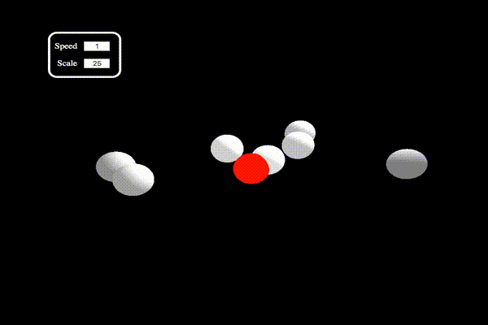

# Angular Planets

An angular directive using `three.js` to create a solar system.

## Usage

1. `bower install angular-planets`
2. Include `angular-planets.js`: `bower_components/angular-planets/directive.js`
3. Add `charlierproctor.angular-planets` as a module dependency to your app.

## Example

- open up `index.html` for an example



```html
<ng-planets height="{{height}}" width="{{width}}" speed="{{speed}}" scale="{{scale}}">
	<ng-planet color="0xFF0000" planet-radius="10" orbital-radius="0"></ng-planet>
	<ng-planet color="0xE0E0E0" planet-radius="10" orbital-radius="0.5"></ng-planet>
	<ng-planet color="0xD0D0D0" planet-radius="10" orbital-radius="1"></ng-planet>
	<ng-planet color="0xC0C0C0" planet-radius="10" orbital-radius="1.5"></ng-planet>
	<ng-planet color="0xB0B0B0" planet-radius="10" orbital-radius="2"></ng-planet>
	<ng-planet color="0xA0A0A0" planet-radius="10" orbital-radius="2.5"></ng-planet>
	<ng-planet color="0x909090" planet-radius="10" orbital-radius="3"></ng-planet>
	<ng-planet color="0x808080" planet-radius="10" orbital-radius="3.5"></ng-planet>
</ng-planets>
```

## Properties

- `ng-planets`:
	- `height`: height of the display
	- `width`: width of the display
	- `speed`: speed multiplier (years / second)
	- `scale`: scale multiplier (pixels / AU)
- `ng-planet`:
	- `color`: color of the planet
	- `planet-radius`: radius of the planet
	- `orbital-radius`: radius of the planet's orbit